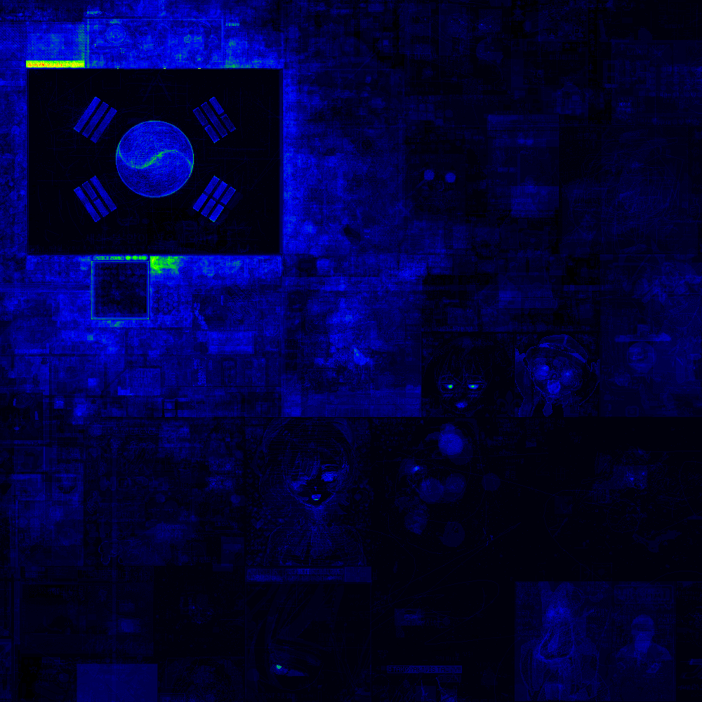

# wplace-heatmap

wplace.live のアーカイブサイト ([wplace.eralyon.net](https://wplace.eralyon.net/)) からタイル画像を取得し、ピクセルの変更頻度を可視化するヒートマップ生成ツールです。

## ヒートマップの例

| 皇居周辺 | 竹島周辺 |
| :---: | :---: |
|  |  |

## 特徴

- **対話型 CLI**: 引数なしで実行すると、ガイドに従って設定を行えます。
- **多様な指定方式**:
  - **Fullsize 形式**: `Koukyo_discord_bot` 等で使われる座標・サイズ指定 (6部または8部形式)。
  - **タイル範囲**: 開始タイルと終了タイルを指定して広範囲をカバー。
  - **単一タイル**: 特定のタイル1枚 (1000x1000px) を対象。
- **自動バージョン取得**: アーカイブサイトの HTML から利用可能な全バージョンを自動でリストアップします。
- **タイルマージロジック**: `v31.096` のような小数点付きの「差分バージョン」を、ベースとなるタイルに重ねて正しく処理します。
- **ローカルキャッシュ**: 一度ダウンロードしたタイルは `tile_cache/` に保存され、再実行時の速度が大幅に向上します。

## インストール

```bash
git clone <repository-url>
cd wplace-heatmap
go mod tidy
```

## 使い方

### 対話モード (推奨)
引数なしで実行すると、対話形式で座標や出力ファイル名を入力できます。
```bash
go run main.go
```

### コマンドライン引数
特定の範囲を直接指定して実行することも可能です。

- **単一タイル:**
  ```bash
  go run main.go -tile 1818-806 -out heatmap.png
  ```

- **タイル範囲:**
  ```bash
  go run main.go -tiles 1818-806_1819-806
  ```

- **Fullsize 形式 (座標-サイズ):**
  ```bash
  go run main.go -fullsize 1818-806-500-500-200-200
  ```

## ヒートマップの色について

変更回数に応じて、以下の色に変化します。
- **黒**: 変更なし
- **青**: 少ない変更
- **緑 / 黄**: 中程度の変更
- **赤**: 頻繁な変更

## 注意事項

- タイルのダウンロードには時間がかかる場合があります（特にキャッシュがない初回）。
- 大規模な範囲（例：16タイル以上）を指定すると、メモリを大量に消費したり処理に時間がかかる可能性があります。
- アーカイブサイトの仕様変更により、バージョン取得ができなくなる可能性があります。その場合は `versions.txt` を手動で作成し、`-auto=false` オプションを使用してください。
